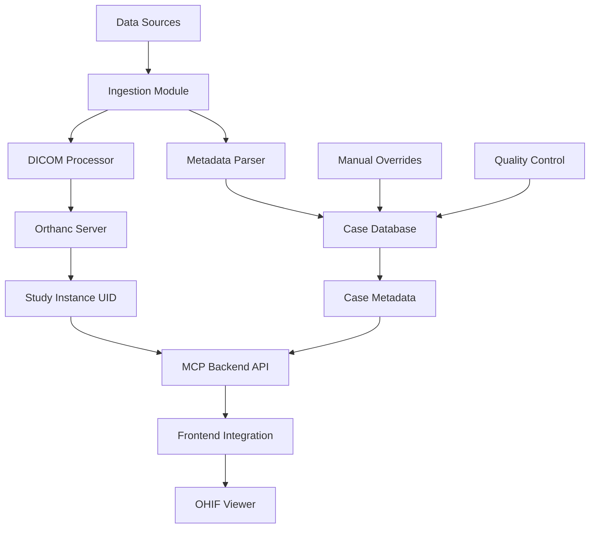

# Automated Case Management System

## 🎯 **Overview**
Fully automated, modular system for ingesting medical cases from multiple data sources, processing DICOM files, and integrating with the Casewise platform.

## 📊 **Data Sources Supported**

### 1. TCIA (The Cancer Imaging Archive)
```
Structure: PatientID/StudyDate-Description-ID/SeriesNumber-Description-ID/DICOM files
Metadata: CSV reports with expert annotations (34+ clinical fields)
Example: TCGA-09-0364 → Multiple expert reviews with lesion measurements
```

### 2. Future Sources (Modular Design)
- Local PACS exports
- RadiAnt/OsiriX exports  
- Custom DICOM directories
- Cloud storage imports

## 🏗️ **System Architecture**



## 🔧 **Core Components**

### 1. **Ingestion Module** (`ingest/`)
- Multi-source data importers
- Automated folder scanning  
- Progress tracking & logging
- Error handling & recovery

### 2. **DICOM Processor** (`dicom/`)
- DICOM file validation
- Study Instance UID extraction
- Orthanc upload automation
- Series organization

### 3. **Metadata Manager** (`metadata/`)
- CSV/JSON parsing
- Clinical data normalization
- Expert annotation aggregation
- Case classification

### 4. **Database Layer** (`database/`)
- SQLite for development
- PostgreSQL for production
- Case metadata storage
- Study UID mappings

### 5. **API Extensions** (`api/`)
- Extend existing MCP backend
- Case listing endpoints
- Search & filtering
- Metadata retrieval

### 6. **Quality Control** (`qc/`)
- DICOM validation
- Metadata verification
- Duplicate detection
- Manual review interface

## 🚀 **Automation Workflow**

### Phase 1: Data Discovery
1. **Scan** data source directories
2. **Identify** new cases/updates
3. **Parse** folder structure
4. **Extract** patient/study identifiers

### Phase 2: DICOM Processing
1. **Validate** DICOM files
2. **Extract** Study Instance UIDs
3. **Upload** to Orthanc server
4. **Verify** successful import

### Phase 3: Metadata Integration
1. **Parse** CSV/metadata files
2. **Match** with DICOM studies
3. **Aggregate** expert annotations
4. **Store** in case database

### Phase 4: System Integration
1. **Generate** case IDs
2. **Update** MCP backend
3. **Refresh** frontend catalog
4. **Deploy** new cases live

## 📝 **Case Data Model**

```python
Case {
    id: str,              # case001, case002, etc.
    patient_id: str,      # TCGA-09-0364
    study_instance_uid: str,
    title: str,
    description: str,
    
    # Clinical Metadata
    specialty: str,       # "Oncology", "Radiology"
    difficulty: str,      # "Beginner", "Intermediate", "Advanced"
    modality: str,        # "CT", "MRI", "PET"
    anatomy: str,         # "Abdomen", "Chest", "Pelvis"
    
    # Expert Annotations (from CSV)
    lesion_measurements: dict,
    expert_reviews: list,
    clinical_findings: dict,
    
    # System Fields
    created_date: datetime,
    status: str,          # "active", "review", "archived"
    source: str,          # "TCIA", "Local", etc.
}
```

## 🎛️ **Configuration**

### Data Source Mapping
```yaml
data_sources:
  tcia:
    path: "C:/Users/Mike/Documents/TCIA Direct DL Data/"
    metadata: "source-documents/excel-reports/"
    format: "patient/study/series/dicom"
    
  local_pacs:
    path: "/data/pacs-exports/"
    format: "custom"
    
orthanc:
  url: "https://api.casewisemd.org/orthanc/"
  username: "admin"
  
database:
  type: "sqlite"  # or "postgresql"
  path: "./cases.db"
```

## 📈 **Scaling Strategy**

### Development Phase
- SQLite database
- Local file processing
- Manual quality control

### Production Phase  
- PostgreSQL database
- Distributed processing
- Automated QC pipelines
- Multi-server deployment

## 🔍 **Quality Assurance**

### Automated Checks
- DICOM file integrity
- Required metadata presence
- Study Instance UID uniqueness
- Expert annotation consistency

### Manual Review
- Clinical accuracy verification
- Case difficulty assessment
- Educational value rating
- Content appropriateness

## 🎓 **Educational Features**

### Case Classification
- **Specialty**: Cardiology, Oncology, Neurology, etc.
- **Difficulty**: Beginner, Intermediate, Advanced, Expert
- **Learning Objectives**: Specific skills/knowledge targets
- **Expected Findings**: Reference annotations

### Assessment Integration
- Pre-case questions
- Post-case evaluations  
- Expert consensus data
- Performance tracking

## 📊 **Monitoring & Analytics**

### System Metrics
- Processing throughput
- Error rates
- Storage utilization
- API performance

### Educational Metrics
- Case completion rates
- User difficulty preferences
- Learning outcome tracking
- Expert annotation agreement

## 🔧 **Development Roadmap**

### Phase 1: Core Infrastructure ✅ Next
- Basic ingestion pipeline
- DICOM processing
- Database setup
- API integration

### Phase 2: Automation
- Scheduled processing
- Error handling
- Quality control
- Monitoring

### Phase 3: Advanced Features
- Multi-source support
- Advanced search
- Educational analytics
- Assessment tools

---

**Status**: 🚧 **In Development**  
**Current Focus**: Phase 1 - Core Infrastructure  
**Next Milestone**: Automated TCIA processing 